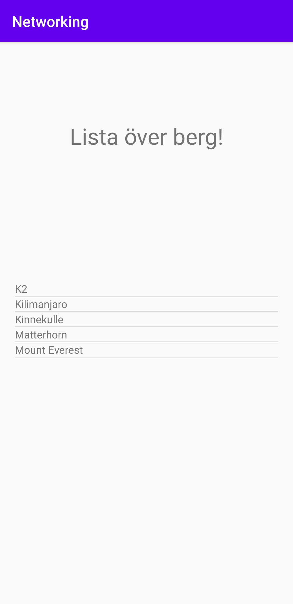
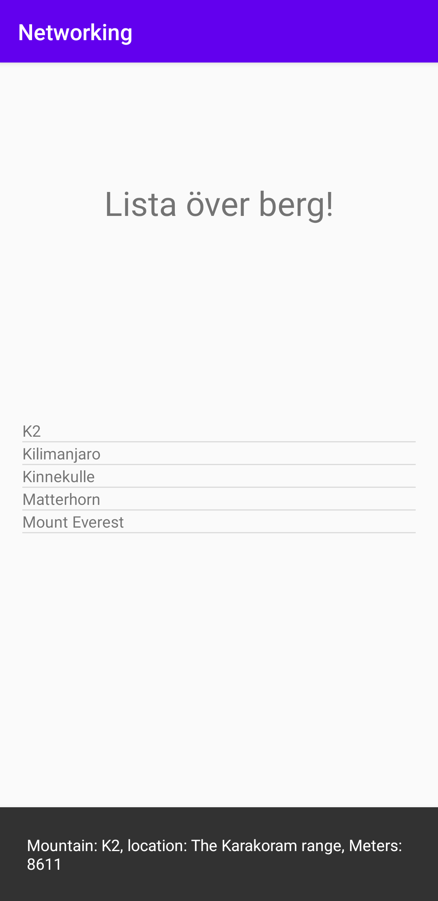

# Assignment 6

### Lagt till ListView
I activity_main.xml har ett ListView element lagts till. ListView elementet lades till för att kunna presentera en array som är hämtad från en webservice. I ListView elementet angavs en bredd och höjd som är satt till match_parent vilket betyder att storleken på elementet kommer att vara densamma som dess förälder. Förutom att en bredd och höjd anges läggs också ett ID till. Det ID som anges kommer att användas för att hantera innehållet i elementet.
```
<ListView
android:id="@+id/my_listview"
android:layout_width="match_parent"
android:layout_height="match_parent"/>
```

### Layoutfil
För att skapa en layoutfil har en fil adderats till mappen layout. Filen döps till listview_item.xml och innehåller ett TextView element. Till elementet skapas ett ID med hjälp av android:id. Det ID som anges är densamma namn som filnamnet på layoutfilen. Förutom ett ID får också elementet en höjd och bredd som är satt till match_parent. Den nya layoutfilen kommer att användas för att applicera innehåll till det redan befintliga ListView elementet.
```
<TextView xmlns:android="http://schemas.android.com/apk/res/android"
android:layout_width="match_parent"
android:layout_height="match_parent"
android:id="@+id/listview_item.xml">

</TextView>
```
### Asset-folder
I projektet för applikationen skapas en ny asset folder som innehåller en directory. Den directory som skapas innehåller en json-fil och består av json data som är hämtad från en webservice. Den data som adderas här är i slutändan inte den data som kommer att presenteras i applikationen utan finns mer till för att testa hur det fungerar att arbeta med json-formatet. Så i och med den asset-folder som skapas finns nu json-data lagrat i en intern-fil i projektet.

### Arraylist & Arrayadapter
I klassen MainActivity kommer ett antal medlemsvariabler att deklareras. Den första medlemsvariabeln är en private vilket betyder att den enbart kommer att kunna nyttjas inom klassen MainActivity. Därefter anges Mountain[] vilket anger att typen kommer att vara en array. Sist anges namnet på variabeln vilket är mountains. Samma sak görs för de två resterande medlemsvariablerna. Den ena deklarerar en ArrayAdapter och den andra deklarerar en ArrayList.

```
public class MainActivity extends AppCompatActivity {
private Mountain[] mountains;
ArrayAdapter<Mountain> adapter;
private ArrayList<Mountain> mountainArrayList;
```
I metoden onCreate initialiseras därefter den ArrayList och adapter som deklarerades i MainActivity. Medlemsvariablerna tilldelas därmed ett innehåll vilket gör de mer användbara än tidigare.
```
mountainArrayList=new ArrayList<Mountain>();
adapter=new ArrayAdapter<>(this,R.layout.listview_item,R.id.listview_item_xml,mountainArrayList);
```
### Metod för att läsa filer
I klassen MainActivity adderas en mängd rader kod som kommer att användas för att läsa textfiler som innehåller json-data. Koden består av en metod som konverterar json-data till en sträng.

````
public static String
convertStreamToString(InputStream is) throws Exception {
BufferedReader reader = new BufferedReader(new InputStreamReader(is));
StringBuilder sb = new StringBuilder();
String line = null;
while ((line = reader.readLine()) != null) {
sb.append(line).append("\n");
}
reader.close();
return sb.toString();
}
````
I metoden onCreate adderas ytterligare rader kod som tolkar den interna json-filen och konverterar datan till en sträng. Koden som adderats innehåller också två stycken Log.d som hjälper till att kontrollera att koden fungerar som den ska och att rätt data konverteras på ett korrekt sätt.

````
try{
InputStream is = getApplicationContext().getAssets().open("json/mountain.json");
String s = convertStreamToString(is);
Log.d("MainActivity","The following text was found in textfile:\n\n"+s);
}catch (Exception e){
Log.e("MainActivity","Something went wrong when reading textfile:\n\n"+ e.getMessage());
}
````
### Ny Java-klass
I projektet skapas en ny Java-fil som innehåller klassen Mountain. I den nya klassen skapas ett antal nya medlemsvariabler som kommer att användas för att hantera olika delar av data i json-filen. Det skapas en ny medlemsvariabel för varje del i arrayen. Den sista medlemsvariabeln som skapas i klassen Mountain innehåller ett nytt objekt, Auxdata. Anledningen till att ett nytt objekt skapas är för att den sista delen i arrayen består av en ny array. Därför behöver också ytterligare en ny klass skapas, den nya klassen är en java-fil som heter Auxdata.java. I Auxdata.java skapas också nya medlemsvariabaler. Båda två är av typen string och kommer att användas för att presentera den sträng som finns lagrad i json-filen.
````
public class Mountain {
private String ID;
private String name;
private String type;
private String company;
private String location;
private String category;
private int size;
private int cost;
private Auxdata auxdata;
}
````
````
public class Auxdata {
private String wiki;
private String img;
}
````
### Gson
För att kunna använda Gson i projektet måste först biblioteket läggas till. När biblioteket har lagts till kan kod adderas till projektet. Koden som innehåller Gson kommer att hjälpa till att parsa arrayer som är av json-format. Gson är ett bibliotek som är skapat av Google och har en större spridning än Java bibliotek och fungerar därför bra för att parsa json-data.

````
Gson gson = new Gson();
mountains = gson.fromJson(s,Mountain[].class);

for (int i = 0; i < mountains.length; i++) {
Log.d("MainActivity", "Hittade berg " + mountains[i].info());
}
````
### AsyncTask
I projektet finns nu en intern-fil som innehåller data från en webservice och presenterar strängar från arrayen, men nu ska istället data hämtas online direkt från webservicen. Därför behövs kod för AsyncTask adderas till MainActivity. Men för att koden ska veta vilken data som ska hanteras måste en url länk anges i koden. Därför adderas en new JsonTask().execute följt av en url länk i metoden onCreate. Url länken går till en webservice som innehåller samma array som i den interna filen. Skillnaden mot den interna filen är att nu kan data både tas bort och läggas till och det enda som behöver göras för att få korrekt data är att uppdatera appen eller starta om den.

````
new JsonTask().execute("https://wwwlab.iit.his.se/brom/kurser/mobilprog/dbservice/admin/getdataasjson.php?type=brom");
````
För att koden ska veta vad som ska exekveras när AsyncTask hämtat färdigt den angivna url länken behöver kod adderas till onPostExecute(). Liknande kod som använts tidigare för att presentera den interna filen används för att presentera den externa filen. I onPostExecute adderas kod för att kunna använda biblioteket Gson för att parsa Json-data. Dessutom får ListView elementet ett innehåll med hjälp av ett angivet ID och sist appliceras också en adapter.

````
Gson gson = new Gson();
mountains = gson.fromJson(json,Mountain[].class);
adapter=new ArrayAdapter<Mountain>(MainActivity.this,R.layout.listview_item,mountains);

ListView listview = findViewById(R.id.my_listview);
listview.setAdapter(adapter);
````
### Snackbar
När en användare trycker på ett av bergsnamnen i listan ska en snackbar visas. För att applikationen ska veta att ett tryck har skett på ett av namnen i listan används listview tillsammans med metoden setOnItemClickListener. Metoden i sin tur innehåller en snackbar som använder positionen för mountains array för att veta vilket objekt som en användare har klickat på. Positionen används tillsammans med metoden info(). Metoden finns i Mountain.java och är av typen string. info() kommer att returnera data från arrayen i form av namnet på berget som valts tillsammans med dess location och size. Snackbar elementet har fått en durationtime på 5000ms med hjälp av setDuration vilket kommer att synliggöra elementet något längre än vad standarden är.

````
listview.setOnItemClickListener(new AdapterView.OnItemClickListener() {
@Override
public void onItemClick(AdapterView<?> parent, View view, int position, long id) {
Snackbar.make(view, mountains[position].info(), Snackbar.LENGTH_LONG).setDuration(5000).show();
}
});
````
````
public String info() {
return "Mountain: " + name + ", location: " + location + ", Meters: " + size;
}
````

### Screenshot över applikationens start


### Screenshot över interaktion med ListView


